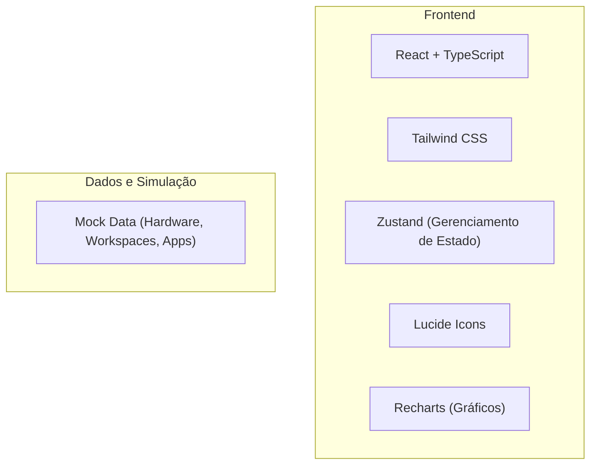

## 1. Design de Arquitetura



## 2. Descrição da Tecnologia
- **Frontend**: React@18 + TypeScript + Vite
- **Estilização**: Tailwind CSS@3 (com customização para dark mode e glassmorphism)
- **Gerenciamento de Estado**: Zustand
- **Gráficos**: Recharts
- **Ícones**: Lucide React
- **Ferramenta de Inicialização**: Vite-init

## 3. Definições de Rotas
| Rota | Propósito |
|-------|---------|
| / | Página Inicial (Dashboard) |
| /workspaces | Página de Workspaces |
| /atalhos | Página de Atalhos |
| /biblioteca | Página de Biblioteca |
| /monitor | Página de Monitor do PC |
| /backup | Página de Backup |
| /estatisticas | Página de Estatísticas |
| /configuracoes | Página de Configurações |

## 4. Estrutura de Arquivos
```
src/
├── components/          # Componentes reutilizáveis
│   ├── Sidebar.tsx     # Barra lateral de navegação
│   ├── Topbar.tsx      # Barra superior
│   ├── Card.tsx        # Componente de card
│   └── Widget.tsx      # Componente de widget
├── pages/              # Páginas do aplicativo
│   ├── Home.tsx        # Dashboard principal
│   ├── Workspaces.tsx  # Workspaces
│   ├── Atalhos.tsx     # Atalhos
│   ├── Biblioteca.tsx  # Biblioteca de apps
│   └── Monitor.tsx     # Monitor do PC
├── hooks/              # Hooks customizados
│   └── useHardware.ts  # Hook para dados de hardware
├── utils/              # Funções utilitárias
└── store/              # Estado global (Zustand)
    └── useAppStore.ts
```
## 5. E necessario ter isso!
🏠 Início

🚀 Workspaces

⚡ Atalhos

📚 Biblioteca

⭐ Favoritos

🔍 Pesquisa

💾 Backup

📊 Monitor do PC

📝 Notas

📅 Agenda

🔗 Links

📈 Estatísticas

🎵 Música

⚙ Configurações