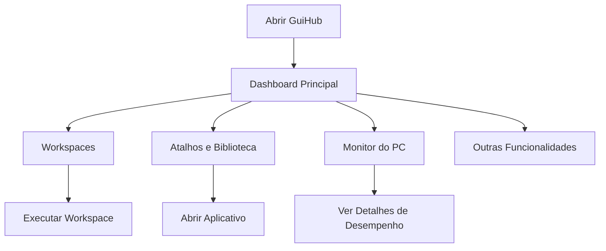

## 1. Visão Geral do Produto
GuiHub é um centro de controle definitivo e premium para produtividade, automação e monitoramento de hardware para Windows. Destina-se a usuários power users, desenvolvedores e entusiastas de tecnologia que buscam uma experiência unificada e futurista para gerenciar seu computador.

## 2. Funcionalidades Principais

### 2.1 Papéis de Usuário
| Papel | Método de Registro | Permissões Principais |
|------|---------------------|------------------|
| Usuário Comum | Não é necessário registro | Acesso a todas as funcionalidades do aplicativo |

### 2.2 Módulo de Funcionalidades
1. **Início**: Dashboard principal com grid de widgets, monitoramento de hardware em tempo real e seções de workspaces e atalhos.
2. **Workspaces**: Criação e gerenciamento de workspaces para organizar apps, sites e comandos.
3. **Atalhos e Biblioteca**: Acesso rápido a atalhos do sistema e biblioteca de aplicativos instalados.
4. **Monitor do PC**: Monitoramento detalhado de desempenho, discos, processos e internet.
5. **Outras Funcionalidades**: Backup, estatísticas, pesquisa global, notas, agenda, música e configurações.

### 2.3 Detalhes das Páginas
| Nome da Página | Módulo | Descrição das Funcionalidades |
|-----------|-------------|---------------------|
| Início | Dashboard | Cards de hardware (CPU, RAM, GPU, SSD, Internet), workspaces, atalhos, widgets diversos |
| Workspaces | Criar e Gerenciar | Interface drag and drop, adicionar programas/sites/pastas/comandos, configuração de delay e admin |
| Atalhos | Categorias | Divididos por categorias (Sistema, Rede, Windows, Energia) |
| Biblioteca | Aplicativos Instalados | Visualização estilo Steam com ícones grandes e ações no hover |
| Monitor do PC | Desempenho | Gráficos grandes em tempo real, discos, processos, internet e teste de velocidade |
| Backup | Perfis de Backup | Seleção de pastas, barras de progresso |
| Estatísticas | Gráficos de Uso | Tempo de uso de apps, tempo de PC ligado |

## 3. Processo Principal
Usuário abre o aplicativo, vê o dashboard principal com monitoramento de hardware, pode acessar workspaces para abrir grupos de apps, usar atalhos rápidos, acessar a biblioteca de apps ou ver detalhes de monitoramento do PC.

## 4. Design de Interface do Usuário

### 4.1 Estilo de Design
- **Cores Principais**: Dark Mode (#0B1220, #111827, #0F172A) com acentos em azul (#3B82F6) e roxo (#8B5CF6)
- **Botões**: Bordas arredondadas (16px a 20px), sombras suaves, brilhos neon sutis em hover
- **Fontes**: Inter / SF Pro Display / Segoe UI (priorizar legibilidade e pesos modernos)
- **Layout**: Baseado em cards com glassmorphism, barra lateral fixa e topbar com pesquisa
- **Ícones**: Lucide Icons (traços finos e modernos)

### 4.2 Visão Geral do Design das Páginas
| Nome da Página | Módulo | Elementos de UI |
|-----------|-------------|-------------|
| Início | Dashboard | Grid de cards, sparklines, widgets, Command Palette |
| Workspaces | Criação | Drag and drop, configurações de delay, checkbox de admin |
| Monitor do PC | Desempenho | Gráficos grandes em tempo real, tabs internas |
| Biblioteca | Apps Instalados | Cards estilo Steam, hover effects |

### 4.3 Responsividade
Layout otimizado para telas 1920x1080, desktop-first.

### 4.4 Efeitos Visuais
- **Glassmorphism**: Fundo semi-transparente com desfoque
- **Micro-animações**: Transições suaves em hover e estados ativos
- **Brilhos Neon**: Efeitos sutis nos elementos principais
